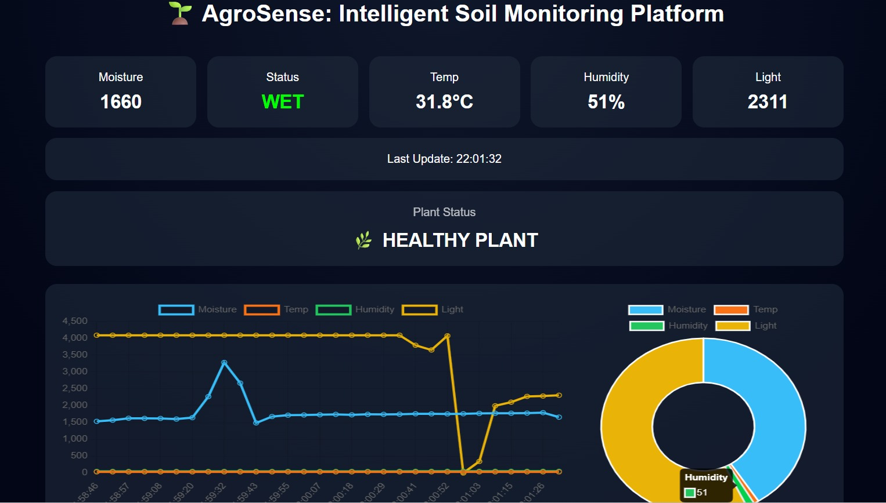
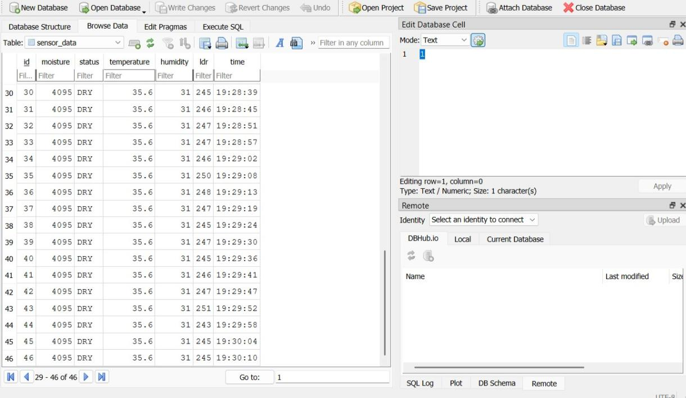

# 🌱 AgroSense: Intelligent Soil Monitoring System

AgroSense is an IoT-based smart agriculture prototype that monitors soil moisture, temperature, humidity, and light in real time.

It uses an ESP32 to send sensor data to a Flask server, which stores it in SQLite and displays it on a live dashboard.

---

## 🚀 Features

- Real-time sensor data collection (ESP32)
- Soil moisture detection (DRY / NORMAL / WET)
- Temperature & humidity monitoring (DHT11)
- Light detection using LDR
- Flask API for data handling
- Live dashboard with charts (Chart.js)
- SQLite database for history

---

## 🧠 Tech Stack

- Hardware: ESP32, DHT11, Soil Moisture Sensor, LDR,Breadboard
- Backend: Flask (Python)
- Database: SQLite
- Frontend: HTML, CSS, JavaScript
- Charts: Chart.js

---

🔌 Circuit Connections
🌡️ DHT11 (Temperature + Humidity)
-VCC → 3.3V
-GND → GND
-DATA → GPIO 4
-10kΩ pull-up resistor between DATA and VCC

🌱 Soil Moisture Sensor
-VCC → 3.3V
-GND → GND
-AO → GPIO 32

🌞 LDR (Voltage Divider Setup)
-One side → 3.3V
-Other side → GPIO 34
-10kΩ resistor from GPIO 34 → GND

⚡ Pin Configuration
-DHT11       → GPIO 4
-Soil Sensor → GPIO 32
-LDR         → GPIO 34

---

## ⚙️ How It Works

1. ESP32 reads sensor data  
2. Sends data to Flask server (POST request)  
3. Flask stores data in SQLite  
4. Dashboard fetches:
   - /latest → current data  
   - /history → past records  
5. Charts display real-time trends  

---

## 🖼️ Preview

### Dashboard

### Database

---

## 🛠️ How to Run

🔗 ESP32 ↔ Flask Communication

The ESP32 sends sensor data to the Flask server using HTTP POST requests over WiFi.

📡 Setup Steps

1. Connect ESP32 to the same WiFi network as your computer
2. In Arduino code, update:

const char* ssid = "YOUR_WIFI_NAME";
const char* password = "YOUR_WIFI_PASSWORD";
const char* serverName = "http://YOUR_PC_IP:5000/data";

3. Find your PC's IP address:

- Windows: "ipconfig"
- Look for IPv4 address (e.g., 192.168.1.5)

4. Upload the code to ESP32

---

🔄 Data Flow

ESP32 → HTTP POST → Flask API → SQLite Database

---

🗄️ SQLite Database Setup

SQLite is automatically created when the Flask server runs.

📌 How it works

- On first run, Flask creates a ".db" file (e.g., "data.db")
- Sensor data is stored in a table inside this file

▶️ Run Flask Server

pip install flask
python flask_code/server.py

If implemented correctly, you should see:

- Server running on "http://0.0.0.0:5000"
- Incoming POST requests in terminal

---

🔍 Verify Data Storage

You can check the database using:

sqlite3 data.db

Then:

SELECT * FROM sensor_data;

---

⚠️ Important Notes

- ESP32 and server must be on the same network
- Use PC IP, not "localhost" in Arduino code
- Ensure endpoint "/data" matches Flask route

---

## ⚠️ Limitations

- SQLite is not scalable  
- No authentication yet  
- Runs on local server only  

---

## 🔮 Future Improvements

- Cloud deployment  
- Mobile app  
- Auto irrigation  
- Alerts system  

---

##👥Contributers
-@Meenal56(https://github.com/meenal56)
-@Shweta-78(https://github.com/Shweta-78)

Built as an IoT + Web integration project.
